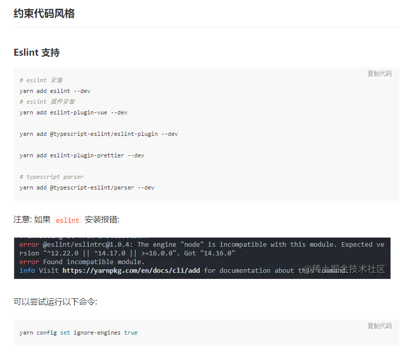
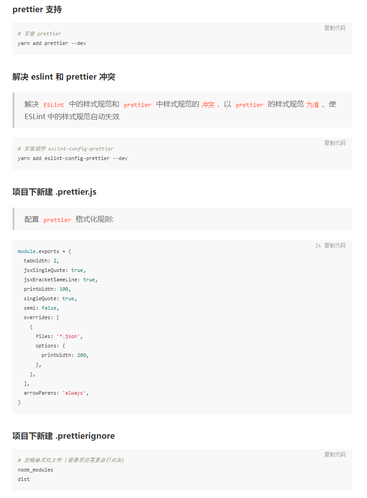

# Vue 3 + script setup +Typescript + Vite

This template should help get you started developing with Vue 3 and Typescript in Vite. The template uses Vue 3 `<script setup>` SFCs, check out the [script setup docs](https://v3.vuejs.org/api/sfc-script-setup.html#sfc-script-setup) to learn more.

## 推荐 IDE Setup

- [VSCode](https://code.visualstudio.com/) + [Volar](https://marketplace.visualstudio.com/items?itemName=johnsoncodehk.volar)

## 简介

基于 Vue3 + Typescript + ElementPlus 开发得项目模板

## 特性

- **🌟 最新技术栈**：使用 Vue3/vite2 等前端前沿技术开发
- **🌟TypeScript**: 应用程序级 JavaScript 的语言
- **🌟sctipt setup**: 是在单文件组件 (SFC) 中使用组合式 API 的编译时语法糖

## 安装使用

- 安装依赖

```bash
yarn install
# or
npm install

```

- 运行

```bash
yarn dev
# or
npm run dev
```

- 打包

```bash
yarn build
# or
npm run build
```

## 约束代码风格

> eslint-config-prettier 会关闭ESLint中有关代码格式化的配置

> eslint-plugin-prettier 把Prettier配置成ESLint的一个插件，让其当做一个linter规则来运行




> 参考[https://juejin.cn/post/7036745610954801166](https://juejin.cn/post/7036745610954801166)

> 一个 Vue 请求库[https://www.attojs.com/](https://www.attojs.com/)

## 浏览器支持

推荐使用版本`Chrome 90+` 浏览器, 如遇到兼容性问题, 可更新至最新版本，其他浏览器可同样处理

_支持现代浏览器, 不支持 `IE`_

| [](http://godban.github.io/browsers-support-badges/)</br>IE | [](http://godban.github.io/browsers-support-badges/)</br>Edge | [](http://godban.github.io/browsers-support-badges/)</br>Firefox | [](http://godban.github.io/browsers-support-badges/)</br>Chrome | [](http://godban.github.io/browsers-support-badges/)</br>Safari | [](http://godban.github.io/browsers-support-badges/)</br>360 |
| :--------------------------------------------------------------------------------------------------------------------------------------------------------------------------------------------------: | :----------------------------------------------------------------------------------------------------------------------------------------------------------------------------------------------------: | :---------------------------------------------------------------------------------------------------------------------------------------------------------------------------------------------------------------: | :-----------------------------------------------------------------------------------------------------------------------------------------------------------------------------------------------------------: | :-----------------------------------------------------------------------------------------------------------------------------------------------------------------------------------------------------------: | :-------------------------------------------------------------------------------------------------------------------------------------------------------------: |
|                                                                                                不支持                                                                                                |                                                                                                  100+                                                                                                  |                                                                                                       100+                                                                                                        |                                                                                                     100+                                                                                                      |                                                                                                      10+                                                                                                      |                                                                               15+                                                                               |
